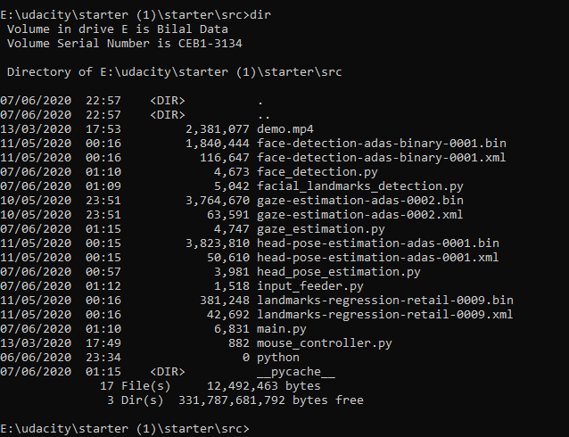
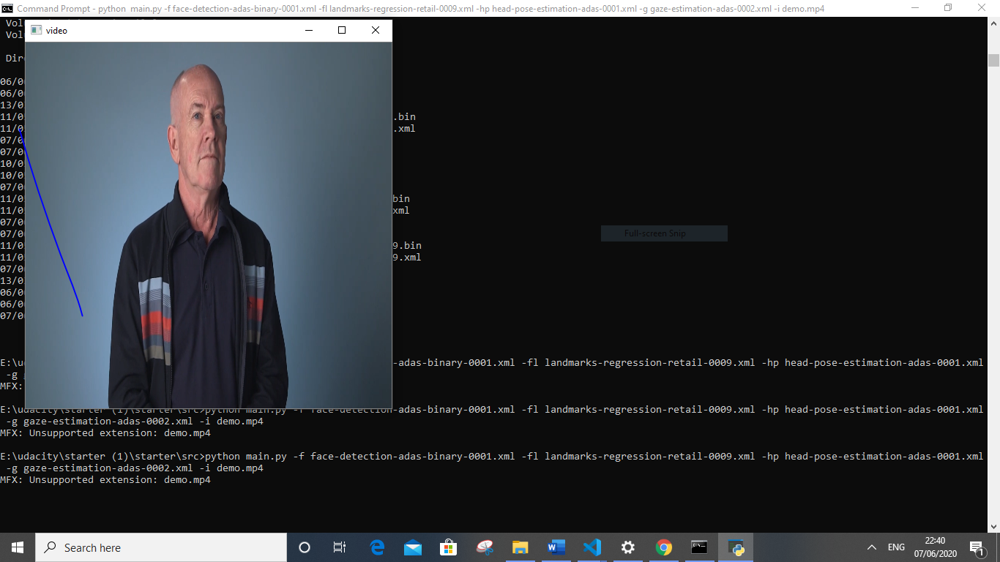
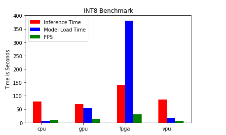
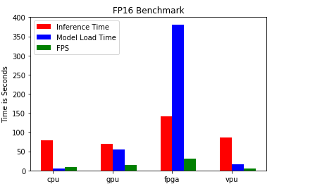
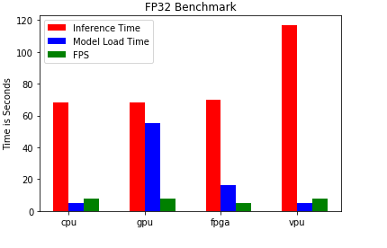

# Computer Pointer Controller

Write a short introduction to your project
In this project, we can control our mouse pointer using gaze detection model,face detection model,headpose detection model and facial landmarks detection model.

## Project Set Up and Installation

### Step 1:Ground work
* Firstly install the prerequisites from requirement.txt
    
        Pip install -r requirement.txt
* Initialize the openvino environment

         C:\Users\Muhammad Bilal>cd C:\Program Files (x86)\IntelSWTools\openvino\bin\setupvars.bat

you have run the above command and every time you open an new terminal window.

We need the following models for this projects.

* [Face Detection Model](https://docs.openvinotoolkit.org/latest/_models_intel_face_detection_adas_binary_0001_description_face_detection_adas_binary_0001.html)

* [Facial Landmarks Detection Model](https://docs.openvinotoolkit.org/latest/_models_intel_landmarks_regression_retail_0009_description_landmarks_regression_retail_0009.html)

* [Head Pose Estimation Model](https://docs.openvinotoolkit.org/latest/_models_intel_head_pose_estimation_adas_0001_description_head_pose_estimation_adas_0001.html)

* [Gaze Estimation Model](https://docs.openvinotoolkit.org/latest/_models_intel_gaze_estimation_adas_0002_description_gaze_estimation_adas_0002.html)

### Step 2: Downloading the pre-trained models

* Goto the model download directory

        cd C:\Program Files (x86)\IntelSWTools\openvino\deployment-tools\tools\model_downlaoder

1. Download Face Detection Model
   
   
       python downloader.py --name face-detection-adas-binary-0001

2. Download Facial landmark detection model 
       
       python downloader.py --name landmarks-regression-retail-0009

3. Download Head Pose Estimation Model

       python downloader.py --name head-pose-estimation-adas-0001

4. Download Gaze Estimation Model
  
       python downloader.py --name gaze-estimation-adas-0002

## Project Structure

E:\udacity\starter (1)\starter\src>tree /f

 

### Demo 
TO run the project using the following command

    python main.py -f face-detection-adas-binary-0001.xml -fl landmarks-regression-retail-0009.xml -hp head-pose-estimation-adas-0001.xml -g gaze-estimation-adas-0002.xml -i demo.mp4
 
## Documentation
This project support the following command
E:\udacity\starter (1)\starter\src>python main.py -h

    usage: main.py [-h] -f FACE_DETECTION_MODEL -fl FACIAL_LANDMARK_MODEL -hp
               HEAD_POSE_MODEL -g GAZE_ESTIMATION_MODEL -i INPUT
               [-l CPU_EXTENSION] [-pt PROB_THRESHOLD] [-d DEVICE]

        optional arguments:
          -h, --help            show this help message and exit
          -f FACE_DETECTION_MODEL, --face_detection_model FACE_DETECTION_MODEL
                                Path to an .xml file with Face Detection model.
          -fl FACIAL_LANDMARK_MODEL, --facial_landmark_model FACIAL_LANDMARK_MODEL
                                Path to an .xml file with Facial Landmark Detection
                                model.
          -hp HEAD_POSE_MODEL, --head_pose_model HEAD_POSE_MODEL
                                Path to an .xml file with Head Pose Estimation model.
          -g GAZE_ESTIMATION_MODEL, --gaze_estimation_model GAZE_ESTIMATION_MODEL
                                Path to an .xml file with Gaze Estimation model.
          -i INPUT, --input INPUT
                                Path to image or video file or CAM
          -l CPU_EXTENSION, --cpu_extension CPU_EXTENSION
                                MKLDNN (CPU)-targeted custom layers.Absolute path to a
                                shared library with thekernels impl.
          -pt PROB_THRESHOLD, --prob_threshold PROB_THRESHOLD
                                Probability threshold for detection fitering.
          -d DEVICE, --device DEVICE
                                Specify the target device to infer on: CPU, GPU, FPGA
                                or MYRIAD is acceptable. Sample will look for a
                                suitable plugin for device specified (CPU by default)
## Documentation of Model
* [Face Detection Model](https://docs.openvinotoolkit.org/latest/_models_intel_face_detection_adas_binary_0001_description_face_detection_adas_binary_0001.html)

* [Facial Landmarks Detection Model](https://docs.openvinotoolkit.org/latest/_models_intel_landmarks_regression_retail_0009_description_landmarks_regression_retail_0009.html)

* [Head Pose Estimation Model](https://docs.openvinotoolkit.org/latest/_models_intel_head_pose_estimation_adas_0001_description_head_pose_estimation_adas_0001.html)

* [Gaze Estimation Model](https://docs.openvinotoolkit.org/latest/_models_intel_gaze_estimation_adas_0002_description_gaze_estimation_adas_0002.html)
## Benchmarks

### INT8

### FP16
 

### FP32
 
 
 
## Results
* First of all, after decreasing prescison, accuracy of the model decreases
* As we see that GPA excutes more frames than the different hardwares, that goes the excution units and isntruction sets which is compatible and optmized with FP16
* FPGA takes higher inference time because it works on each gate and programmed it to be compatible for this application
### Edge Cases
If there is more than one face detected, it extracts only one face and do inference on it and ignoring other faces.

